# Solar Power Management PCB ☀️
The following project is a power management PCB designed to charge a lithium-ion battery using a solar panel and discharge it into an Arduino for low-power applications.

<p align="center">
    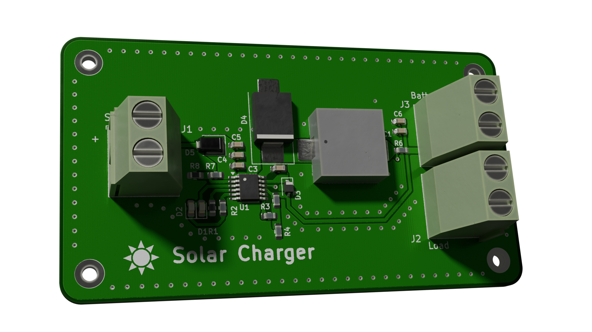
</p>
<p align="center"><i>Blender Render</i></p>

## Arduino Low-Power Application 🔋
Before diving into the PCB design I am going to explore the low-power application that I have designed for this project. The application [Full_Functionality.ino](./Arduino_Code/Full_Functionality/Full_Functionality.ino) utilizes the [DHT11 sensor](https://www.arduino.cc/reference/en/libraries/dht11/) to record temperature and humidity readings, then writes them to the onboard EEPROM (1 KB). Once the data has been stored in the EEPROM the arduino goes into a lower power state by utilizing the [narcoleptic library](https://github.com/brabl2/narcoleptic). I am running this entire application on an [Arduino Uno REV3](https://docs.arduino.cc/hardware/uno-rev3/#tech-specs).

For this application, I would like the Arduino to last as long as possible on battery power. To reduce it's power consumption I referenced the following two articles: [The Arduino Guide to Low Power Design](https://docs.arduino.cc/learn/electronics/low-power/), [Arduino minimal power usage](https://arduino.stackexchange.com/questions/21616/arduino-minimal-power-usage), and [Power saving techniques for microprocessors
](https://www.gammon.com.au/power). A lot of the common techniques involved disabling unused peripherals, reducing clock speeds, and forcing the CPU into a low power mode. One extremely effective method that <b>I did not</b> attempt was utilizing a "bare bones" Atmega328 board. By stripping away a lot of unnecessary components (i.e. USB controller, LDO, etc...) you can significantly reduce the power consumption.

## Arduino Pin-out

| **Arduino** | **DHT11** |
| ------------- | ------------- |
| 5V            | VCC           | 
| GND           | GND           |   
| 2/PD2         | DATA          | 

<br>

<p align="center">
    
</p>
<p align="center"><i>Arduino Pin-out</i></p>

## Power Consumption Tests 🪫
To test the power consumption of the Arduino, I used a bench power supply, a 100-ohm shunt resistor, and the Analog Discovery 2 USB oscilloscope.

### Default Sketch
For the first test I had the Arduino running the default sketch as seen below.
```C++
void setup () {}
void loop () {}
```
The current consumption was measured at two supply voltage levels: 12V and 8V. Realistically, for our application, we will be running the Arduino off 8V through the barrel connector.
* 12V - 44.17mA
* 8V - 25.07mA
<p align="center">
    
    
</p>
<p align="center"><i>Current Draw 12V [LEFT] vs 8V [RIGHT]</i></p>

### Low_Power_Sketch.ino
The Low_Power_Sketch.ino utilizes the sleep, wdt, and power library to lower the Arduino's power consumption. To lower the Arduino's power consumption I did the following:

* Desoldered the 5V 'ON' LED
* Disabled USER LED 13
* Disabled ADC
* Changing the clock pre-scalar had no effect on the power consumption so I left it as 1.
* Disabled all peripheral modules (SERIAL, ADC, SPI, USART, TIMER 0, TIMER 1, TIMER 2, I2C)
* Disabled brown-out feature. Brownout detection is a hardware feature that shuts down the processor if the system voltage is below a threshold
* Put the CPU into [SLEEP_MODE_PWR_DOWN](https://onlinedocs.microchip.com/pr/GUID-A834D554-5741-41A3-B5E1-35ED7CD8250A-en-US-5/index.html?GUID-825A28EE-C4E4-4C03-864F-92AA9BA41231). The Microchip web page explains what occurs during this mode.

The resulting current consumptions was:
* 8V - 18.78mA

<p align="center">
    
</p>
<p align="center"><i>Current Draw Low_Power_Sketch.ino</i></p>

### Narcoleptic_Sketch.ino
The Narcoleptic_Sketch.ino uses many of the same techniques as the above sketch; however, this script utilizes the [Narcoleptic library](https://github.com/brabl2/narcoleptic) to achieve its low power consumption. The following techniques were used:

* Desoldered the 5V 'ON' LED
* Disabled USER LED 13
* Disabled ADC
* Changing the clock pre-scalar had no effect on the power consumption so I left it as 1.
* Disabled all peripheral modules (SERIAL, ADC, SPI, USART, TIMER 0, TIMER 1, TIMER 2, I2C)
* Disabled brown-out feature. Brownout detection is a hardware feature that shuts down the processor if the system voltage is below a threshold
* Narcoleptic.Delay(x_milliseconds) is called to force the CPU in a low-power state for x_milliseconds.

The resulting current consumptions was:
* 8V - 18.27mA

<p align="center">
    
</p>
<p align="center"><i>Current Draw Narcoleptic_Sketch.ino</i></p>

### Full_Functionality.ino
The Full_Functionality.ino sketch is the main program that performs the tasks described in the introduction while using the low power modes that were used in Narcoleptic_Sketch.ino. 

The resulting current consumptions was:
* Awake mode (8V) - 22.42mA
* Low power mode (8V) - 18.30mA

<p align="center">
    
</p>
<p align="center"><i>Full_Functionality.ino Low power mode [LEFT] vs Awake mode [RIGHT]</i></p>

### Future Power Consumption Improvements
Despite the power savings documented above, there are still quite a few methods that were left out during this process, which can yield large power savings.

* The first method is extensively discussed in the [Power saving techniques for microprocessors](https://www.gammon.com.au/power) article. You can strip various unnecessary parts from the Arduino, leaving you with a bare-bones version of the board. This includes the voltage regulators (for +5V and +3.3V), USB interface chip (for the USB port), and the "power" LED. According to the article, this resulted in a current consumption of 360uA!
    * The Arduino Uno Rev 3 uses the NCP1117ST50T3G as it's 5V linear voltage regulator. This regulator has a quiescent current of 10mA! If you bypass the LDO you can avoid wasting power.
* Secondly, the ATmega328P MCU can be run at lower frequencies and hence a lower voltage which can reduce the boards power consumption

## Power Management Components ⚡
Now that we know the power consumption of the Arduino, we can begin picking components for this project. This section will focus on the choice of solar panel and lithium-ion battery.

### Lithium Ion Battery 🔋
For the battery, I ended up selecting a pair of lithium-ion batteries I already had at home. The batteries were two 3.7V 2600mAh lithium-ion batteries from PKCELL. The batteries were arranged in series in a battery pack to produce an output voltage of 7.4V and a capacity of 2600 mAh. [Li-ion Battery ICR18650 2600mAh 3.7V Datasheet](https://www.parts-express.com/pedocs/specs/142-202--pkcell-flat-top-18650-li-ion-3.7v-2600mah-rechargeable-battery-spec-sheet.pdf). Some important specifications to note about this battery are the following:
* Nominal Voltage - 3.7V
* Charging Cut-off Voltage - 4.2V
* Discharge Cut-off Voltage - 3.0V
* Standard Charge - Constant Current 0.5C Constant Voltage 4.2V 0.01 C cut-off
* Standard Discharge - Discharge at 0.2 C to 3.0V


<p align="center">
    
</p>
<p align="center"><i>PKCELL Lithium Ion Batteries</i></p>

#### Arduino Low-Power Application Discharge Rate
Now that we know the battery capacity and the Arduino's current consumption, we can determine the lifespan of the battery while supplying the Arduino.

| **Variable**  | **Description**           | **Value** |
| ------------- | -------------             | --------- |
| C             | Battery Capacity          | 2600 mAh  | 
| Is            | Current while sleeping    | 18.3mA    |
| Ia            | Current while awake       | 22.4mA    |
| Wph           | # of wakeups per hour     | 1         |
| Wt            | Duration of a single wake | 1s        |

Time awake per hour: ${Twph=Wph\cdot Wt=1s}$

Time asleep per hour: ${Tsph=msph-Wtph=3599s}$

Average current draw: ${Iavg=\left(\left(Ia\cdot Twph\right)+\left(Is\cdot Tsph\right)\right)/3600s=18.3011\thinspace mA}$

Life of battery: ${\frac{C}{I_{avg}}=\frac{2600mAh}{18.3011mA}=142.067\thinspace hours=5.919\thinspace days}$

Alternatively, you could use this [Battery Life Calculator](https://oregonembedded.com/batterycalc.htm), which includes the self-discharge rate of a battery in its calculations. Based on this calculator, the battery's life ends up being 5.03 days.

### Solar Panel 🔆
To increase the lifespan of the battery, you could further decrease the current consumption of the Arduino using the previously mentioned methods, or you could hook up a solar panel to recharge the batteries.

After a bit of searching I was able to find a 12V 4.2W (350mA Max) portable [solar panel module](https://www.amazon.ca/Portable-Polysilicon-Battery-Charger-Efficiency/dp/B07S1P67HL/ref=sr_1_97_sspa?crid=2WAO18NW0X2GN&dib=eyJ2IjoiMSJ9.fZVIoLELaw3YZhhkogK5VGuvzYc6wwH_Px50gEwUL5AK6Nxr_yeX3NtH-g3Q1hlIK30yAnZ0evMQHhDVoLYAm4sbS6SBN7zU1qKFeF3U7BU.zWxxjvWhspQamoYMqpsdiUn7VfXNYG4ixH8fwb_Tuoc&dib_tag=se&keywords=solar+cell&qid=1717475335&s=hi&sprefix=solar+ceil%2Ctools%2C96&sr=1-97-spons&sp_csd=d2lkZ2V0TmFtZT1zcF9hdGZfbmV4dA&psc=1).

#### Ideal Conditions
If we assume ideal conditions where the sun is visible 100% of the day we can determine how long it would take for the solar panel to recharge the battery. 
* ${t}$ is the time (in hours) it takes to charge the battery
* ${Q}$ is the capacity of the battery (in mAh), which is 2600mAh in our case
* ${I}$ is the current (in mA) that the panel can supply, which in our case is 350mA max.

${t=\frac{Q}{I}=\frac{2600}{350}=7.42\thinspace hours}$

#### Real World Conditions
For real-world conditions, we can assume that the total hourly power is closer to 50% of the solar panel's maximum power (175mA). Additionally, we can include the power consumption of the Arduino, which is around 18.3mA.
* ${t}$ is the time (in hours) it takes to charge the battery
* ${Q}$ is the capacity of the battery (in mAh), which is 2600mAh in our case
* ${Iload}$ is the net current (in mA) that the Arduino is drawing, which is 18.3mA in our case
* ${Isolar}$ is the net current (in mA) that the solar panel is providing, which is 175mA in our case. 

${I_{net}=I_{solar}-I_{net}=175\thinspace mA-18.3\thinspace mA=156.7\thinspace mA}$

${t=\frac{Q}{I_{net}}=\frac{2600}{156.7}=16.6\thinspace hours}$

## Battery Management IC 🔌
The battery management IC being used in this project is the [LT3652](https://www.analog.com/en/products/lt3652.html)

* The LT3652 is a complete monolithic step-down battery charger designed for solar power and capable of supporting multi-chemistry, multi-cell batteries.
* Input Supply Voltage Regulation Loop for MPPT Solar Applications
* Wide Input Voltage Range: 4.95V to 32V (40V Abs Max)
* Programmable Charge Rate: Up to 2A
* User-Selectable Termination: C/10 or On-Board Termination Timer
* Resistor Programmable Float Voltage: Up to 14.4V
* Accommodates Li-Ion/Polymer, LiFePO4, SLA Chemistries
* The primary reason for choosing this IC was because a simulation model for it is available in LTspice.

<p align="center">
    
</p>

## Design Notes
- [x] VIN Input Supply
- [x] Charge Current Programming
- [x] BOOST Supply
- [x] VIN/BOOST Start-Up Requirement
- [x] VBAT Output Decoupling
- [x] Inductor Selection
- [x] Rectifier Selection
- [x] Battery Float Voltage Programming
- [x] Input Supply Voltage Regulation
- [x] Battery Voltage Temperature Compensation
- [x] Status Pins
- [x] C/10 Termination

### VIN Input Supply
* A high-quality, low ESR decoupling capacitor is recommended to minimize voltage glitches on VIN

#### RMS Ripple Current
${I_{CVIN\left(RMS\right)}≅I_{CHG\left(MAX\right)}•\left(V_{BAT}/V_{IN}\right)•\left(\left[V_{IN}/V_{BAT}\right]-1\right)^{\frac{1}{2}}}$

${I_{CVIN\left(RMS\right)}=0.5\cdot \left(\frac{7.4}{12}\right)\cdot \left(\left(\frac{12}{7.4}\right)-1\right)^{\frac{1}{2}}=0.19447\thinspace A}$

* where ${I_{CHG\left(MAX\right)}}$ is the maximum average charge current
(100mV/ ${R_{SENSE}}$ ).
* The simple worst-case of ½ • ${I_{CHG\left(MAX\right)}}$ is commonly
used for design.
* Ripple current in capacitors is crucial to consider because it directly impacts the component's performance, reliability, and lifespan by causing internal heating and potential degradation

#### Input Ripple Voltage
Bulk capacitance is a function of desired input ripple voltage (ΔVIN), and follows the relation:
${C_{IN{\left(BULK\right)}}=I_{CHG{\left(MAX\right)}}•\left(V_{BAT}/V_{IN}\right)/∆V_{IN}\thinspace \left(µF\right)}$

${C_{IN\left(BULK\right)}=0.4\cdot \frac{\left(\frac{7.4}{12}\right)}{0.1}=2.46\thinspace uF}$

* Input ripple voltages above 0.1V are not recommended. 10µF is typically adequate for most charger applications.

### Charge Current Programming
The data sheet describes the charge current programming as follows: <i>"The LT3652 charger is configurable to charge at average currents as high as 2A. Maximum charge current is set by choosing an inductor sense resistor (RSENSE)..."</i> 

${R_{SENSE}\thinspace = \thinspace 0.1/I_{CHG\left(MAX\right)}}$

The maximum charging current is limited by the maximum current output of the solar panel, which is 350 mA. Therefore, we can set the limit to 400 mA to allow for some headroom.

${R_{SENSE}\thinspace = \thinspace 0.1/I_{CHG\left(MAX\right)}=0.1/0.4=0.25Ω}$

### BOOST Supply
The voltage on the decoupling capacitor is refreshed through a diode, with the anode connected to either the battery output voltage or an external source, and the cathode connected to the BOOST pin. Rate the diode average current greater than 0.1A, and reverse voltage greater than VIN(MAX).

### VIN/BOOST Start-Up Requirement
When an LT3652 charger is not switching, the SW pin is
at the same potential as the battery, which can be as high
as VBAT(FLT). As such, for reliable start-up, the VIN supply
must be at least 3.3V above VBAT(FLT). Once switching
begins and the BOOST supply capacitor gets charged
such that (VBOOST – VSW) > 2V, the VIN requirement no
longer applies.

### VBAT Output Decoupling
An LT3652 charger output requires bypass capacitance connected from the BAT pin to ground (CBAT). A 10µF ceramic capacitor is required for all applications.
* If it is desired to operate a system load from the LT3652 charger output when the battery is disconnected, additional bypass capacitance is required. In this type of application, excessive ripple and/or low amplitude oscillations can occur without additional output bulk capacitance. For these applications, place a 100µF low ESR non-ceramic capacitor (chip tantalum or organic semiconductor capacitors such as Sanyo OS-CONs or POSCAPs) from BAT to ground, in parallel with the 10µF ceramic bypass capacitor. This additional bypass capacitance may also be required in systems where the battery is connected to the charger with long wires. The voltage rating of CBAT must meet or exceed the battery float voltage.

### Inductor Selection
The primary criterion for inductor value selection in an LT3652 charger is the ripple current created in that inductor.
* Once the inductance value is determined, an inductor must also have a saturation current equal to or exceeding the maximum peak current in the inductor
* ${L=\frac{10•R_{SENSE}}{\frac{ΔI_L}{I_{CHG\left(MAX\right)}}}•V_{BAT\left(FLT\right)}•\left(1-\frac{V_{BAT\left(FLT\right)}}{V_{IN\left(MAX\right)}}\right)\thinspace \left(µH\right)}$
    * ${L=\frac{10\cdot 0.2}{\frac{0.12}{0.4}}\cdot 7.4\cdot \left(1-\frac{7.4}{12}\right)=23.64\thinspace uH}$    
* In the above relation, VIN(MAX) is the maximum operational voltage. Ripple current is typically set within a range of 25% to 35% of ICHG(MAX), so an inductor value can be determined by setting 0.25 < ΔIL/ICHG(MAX) < 0.35
* Magnetics vendors typically specify inductors with maximum RMS and saturation current ratings. Select an inductor that has a saturation current rating at or above ${\left(1+ΔI_{MAX}/2\right)•I_{CHG\left(MAX\right)}}$, and an RMS rating above ${I_{CHG\left(MAX\right)}}$.
* Inductors must also meet a maximum voltsecond product requirement. If this specification is not in the data sheet of an inductor, consult the vendor to make sure the maximum volt-second product is not being exceeded by your design. The minimum required volt-second product is: ${V_{BAT\left(FLT\right)}•\left(\frac{1-V_{BAT\left(FLT\right)}}{V_{IN\left(MAX\right)}}\right)\left(V•\thinspace µS\right)}$

### Rectifier Selection
The rectifier diode from SW to GND, in a LT3652 battery charger provides a current path for the inductor current when the main power switch is disabled. The rectifier is selected based upon forward voltage, reverse voltage, and maximum current. A Schottky diode is required, as low forward voltage yields the lowest power loss and highest efficiency. The rectifier diode must be rated to withstand reverse voltages greater than the maximum VIN voltage.

The minimum average diode current rating (${I_{DIODE\left(MAX\right)}}$)
is calculated with maximum output current (${I_{CHG\left(MAX\right)}}$),
maximum operational VIN, and output at the precondition
threshold (${V_{BAT\left(PRE\right)},\thinspace or\thinspace 0.7•V_{BAT\left(FLT\right)}}$): ${I_{DIODE\left(MAX\right)}>I_{CHG\left(MAX\right)}•\frac{V_{IN\left(MAX\right)}-V_{BAT\left(PRE\right)}}{V_{IN\left(MAX\right)}}\left(A\right)}$

${I_{DIODE\left(MAX\right)}>0.4\cdot \frac{12-5.18}{12}}$

${I_{DIODE\left(MAX\right)}>0.2273\thinspace A}$

### Battery Float Voltage Programming
The output battery float voltage (VBAT(FLT)) is programmed by connecting a resistor divider from the BAT pin to VFB. VBAT(FLT) can be programmed up to 14.4V.

Using a resistor divider with an equivalent input resistance at the VFB pin of 250k compensates for input bias current error. Required resistor values to program desired VBAT(FLT) follow the equations:
* ${R_{FB1}=\left(V_{BAT\left(FLT\right)}•2.5•10^5\right)/3.3\thinspace \left(Ω\right)}$
* ${R_{FB2}=\left(R_{FB1}•\left(2.5•10^5\right)\right)/\left(R_{FB1}-\left(2.5•10^5\right)\right)\thinspace \left(Ω\right)}$ 


The charge function operates to achieve the final float voltage of 3.3V on the VFB pin. The auto-restart feature initiates a new charging cycle when the voltage at the VFB pin falls 2.5% below that float voltage. Because the battery voltage is across the VBAT(FLT) programming resistor divider, this divider will draw a small amount of current from the battery (IRFB) at a rate of: IRFB = 3.3/RFB2

Precision resistors in high values may be hard to obtain, so for some lower VBAT(FLT) applications, it may be desirable to use smaller-value feedback resistors with an additional resistor (RFB3) to achieve the required 250k equivalent resistance. The resulting 3-resistor network, as shown in Figure 5, can ease component selection and/or increase output voltage precision, at the expense of additional current through the feedback divider.

${\frac{R_{FB2}}{R_{FB1}}=\frac{3.3}{\left(V_{BAT\left(FLT\right)}-3.3\right)}}$

${\frac{R_{FB2}}{R_{FB1}}=\frac{3.3}{\left(7.4-3.3\right)}=0.80487}$

Set the divider current (IRFB) = 10uA yields:

${R_{FB2}=\frac{3.3}{10uA}=330k}$

Solving for RFB1:

${R_{FB1}=\frac{330k}{0.80487}=410k}$

The divider equivalent resistance is:

${R_{FB1}||R_{FB2}=182.8k}$

To satisfy the 250k equivalent resistance to the VFB pin: 

${R_{FB3}=250k-182.8k=67.2k}$

Because the VFB pin is a relatively high impedance node, stray capacitances at this pin must be minimized. Special attention should be given to any stray capacitances that
can couple external signals onto the pin, which can produce undesirable output transients or ripple. Effects of parasitic capacitance can typically be reduced by adding
a small-value (20pF to 50pF) feed forward capacitor from the BAT pin to the VFB pin

### Input Supply Voltage Regulation

The LT3652 contains a voltage monitor pin that enables programming a minimum operational voltage. Connecting a resistor divider from VIN to the VIN_REG pin enables programming of minimum input supply voltage, typically used to program the peak power voltage for a solar panel. Maximum charge current is reduced when the VIN_REG pin is below the regulation threshold of 2.7V. If an input supply cannot provide enough power to satisfy
the requirements of an LT3652 charger, the supply voltage will collapse. A minimum operating supply voltage can thus be programmed by monitoring the supply through a resistor divider, such that the desired minimum voltage corresponds to 2.7V at the VIN_REG pin. The LT3652 servos the maximum output charge current to maintain
the voltage on VIN_REG at or above 2.7V. Programming of the desired minimum voltage is accomplished by connecting a resistor divider as shown in
Figure 6. The ratio of RIN1/RIN2 for a desired minimum voltage (VIN(MIN)) is:

${\frac{R_{IN1}}{R_{IN2}}=\left(\frac{V_{IN\left(MIN\right)}}{2.7}\right)-1}$

If the voltage regulation feature is not used, connect the VIN_REG pin to VIN.

For my configuration I will set the ${V_{IN\left(MIN\right)}}$ as 10V 

${\frac{R_{IN1}}{R_{IN2}}=\frac{10}{2.7}-1=2.7037}$

${R_{IN1}=270k}$

${R_{IN2}=100k}$

### MPPT Temperature Compensation

### Battery Voltage Temperature Compensation

<i>See Page 16 of the datasheet for MPPT temperature compensation and battery voltage temperature compensation</i>

In this design I opted to ignore the following features to simplify the design. Nevertheless, these features are actually very easy to work with and are well documented within the datasheet.

### Status Pins

The LT3652 reports charger status through two open collector outputs, the CHRG and FAULT pins. These pins can accept voltages as high as VIN, and can sink up to 10mA when enabled. The CHRG pin indicates that the charger is delivering current at greater that a C/10 rate, or 1/10th of the programmed maximum charge current. The FAULT pin signals bad battery and NTC faults.

If the battery is removed from an LT3652 charger that is configured for C/10 termination, a sawtooth waveform of approximately 100mV appears at the charger output, due to cycling between termination and recharge events, This cycling results in pulsing at the CHRG output. An LED connected to this pin will exhibit a blinking pattern, indicating to the user that a battery is not present. The frequency of this blinking pattern is dependent on the output capacitance.

<p align="center">
    
</p>
<p align="center"><i>Status Pins Table</i></p>

### C/10 Termination

The LT3652 supports a low-current based termination scheme, where a battery charge cycle terminates when the current output from the charger falls to below one-tenth of the maximum current, as programmed with RSENSE. The C/10 threshold current corresponds to 10mV across RSENSE. This termination mode is engaged by shorting the TIMER pin to ground.
When C/10 termination is used, a LT3652 charger will source battery charge current as long as the average current level remains above the C/10 threshold. As the full-charge float voltage is achieved, the charge current falls until the C/10 threshold is reached, at which time the charger terminates and the LT3652 enters standby mode. The CHRG status pin follows the charger cycle, and is high impedance when the charger is not actively charging. When VBAT drops below 97.5% of the full-charged float voltage, whether by battery loading or replacement of the battery, the charger automatically re-engages and starts charging. There is no provision for bad battery detection if C/10 termination is used.

## Thermal Consideration 🔥
A schottky diode is placed at the output of a solar panel primarily to prevent reverse current flow, which can discharge the battery at night or during low-light conditions. For this schottky diode I had originally chosen the [B5817WS-TP](https://www.digikey.com/en/products/detail/micro-commercial-co/B5817WS-TP/2213553). One thing to consider is the thermal performance of this diode. 

According to the datasheet, we expect this to operate with an average forward voltage drop of 0.45V. We also expect it to sink 350mA at the solar panel's peak performance.

${P=V\cdot I=0.45\cdot 0.350=0.1575\ Watts}$

According to the datasheet the maximum thermal resistance is 500°C/W from junction to ambient. Therefore we would expect the diode to rise above ambient temperature by:

${T=500°C/W\cdot 0.1575W=78.75°C}$

While this is technically within the operating specifications of the diode, it would be wise to consider a diode with superior thermal performance to prevent potential thermal runaway.

As such, a suitable alternative with a slightly larger case size would be the [SMD22PL-TP](https://www.digikey.ca/en/products/detail/micro-commercial-co/SMD22PL-TP/1793265). By using the same calculations as above, we can expect the following power dissipation:

${P=V\cdot I=0.5\cdot 0.350=0.175\ Watts}$

${T=115°C/W\cdot 0.175W=20.125°C}$


## Simulation
<p align="center">
    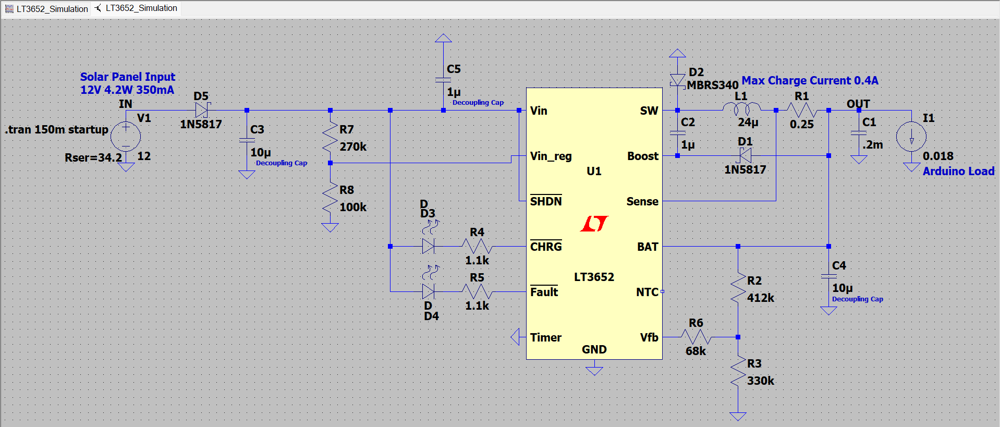
</p>
<p align="center"><i>LTSpice Schematic Capture</i></p>

<p align="center">
    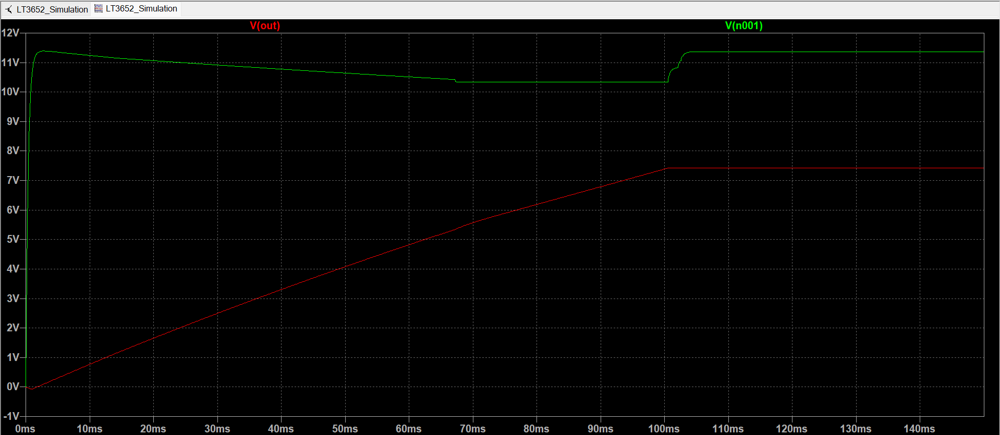
</p>
<p align="center"><i>LTSpice Charge Simulation 0% --> 100% (Vin vs Vout)</i></p>

<p align="center">
    
</p>
<p align="center"><i>LTSpice CHG LED Status</i></p>

### Layout Considerations
* The switch node (Pin SW) trace should be kept as short as possible to minimize high frequency noise.
* The input capacitor (CIN) should be placed close to the IC to minimize this switching noise.
* Short, wide traces on these nodes also help to avoid voltage stress from inductive ringing.
* The BOOST decoupling capacitor should also be in close proximity to the IC to minimize inductive ringing.
* The SENSE and BAT traces should be routed together, and these and the VFB trace should be kept as short as possible. Shielding these signals from switching noise with a ground plane is recommended.
* High current paths and transients should be kept isolated from battery ground, to assure an accurate output voltage reference.
* The LT3652 packaging has been designed to efficiently remove heat from the IC via the Exposed Pad on the backside of the package, which is soldered to a copper footprint on the PCB. This footprint should be made as large as possible to reduce the thermal resistance of the IC case to ambient air.

<p align="center">
    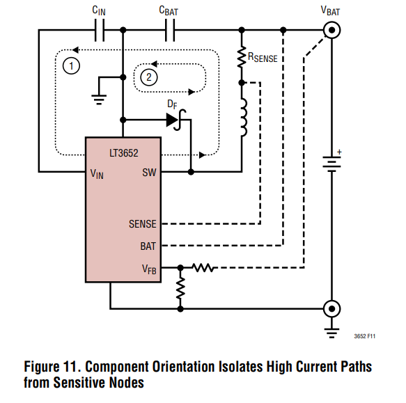
</p>
<p align="center"><i>Layout power loops</i></p>

## PCB Design
<p align="center">
    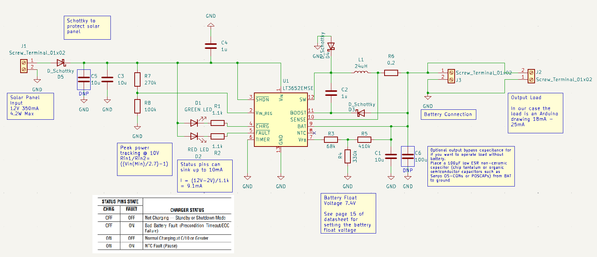
</p>
<p align="center"><i>Schematic Design</i></p>
<p align="center">
    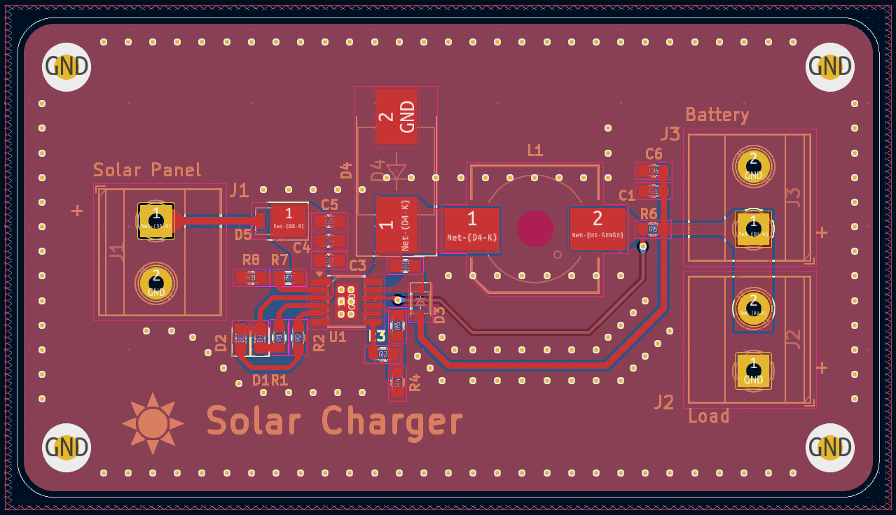
</p>
<p align="center"><i>PCB Design</i></p>

### Design Choices
* I have incorporated 6 vias beneath the ground pad of the LT3652, connecting to the bottom layer ground plane. This design choice aims to improve thermal dissipation by effectively transferring heat away from the chip and to the lower ground plane.
* I have placed grounded via stitching all along the edge of the board to achieve multiple benefits: reducing electromagnetic emissions by containing radially propagating waves, improving shielding to protect internal circuitry from external interference, and enhancing ground connectivity by linking ground planes across different layers, thereby ensuring efficient current return paths and low impedance. 
* Via stitching has been strategically applied around traces and components associated with high-frequency switching nodes, along with sensitive feedback lines. This technique is known as shielding and helps prevent the coupling of EM waves into stray traces in two ways: The loop inductance in the via region is lower because the via is closer to ground. Being closer to ground causes the signal via/ground via transition to dominate the total capacitance experienced along the via. 
    * You can calculate the maximum frequency that a given array of stitching vias will shield against based on their spacing. ${f_{max}=\frac{c}{8\cdot \:s\cdot \sqrt{ε_r}}=\frac{299792458}{8\:\cdot \:0.002\cdot \sqrt{4.4}}=8.93GHz}$
        * (c) - The speed of light 299792458 m/s
        * (s) - The spacing between Via's
        * (ε) - relative permittivity (εr) of the PCB material. For FR-4 ≈ 4.4

<p align="center">
    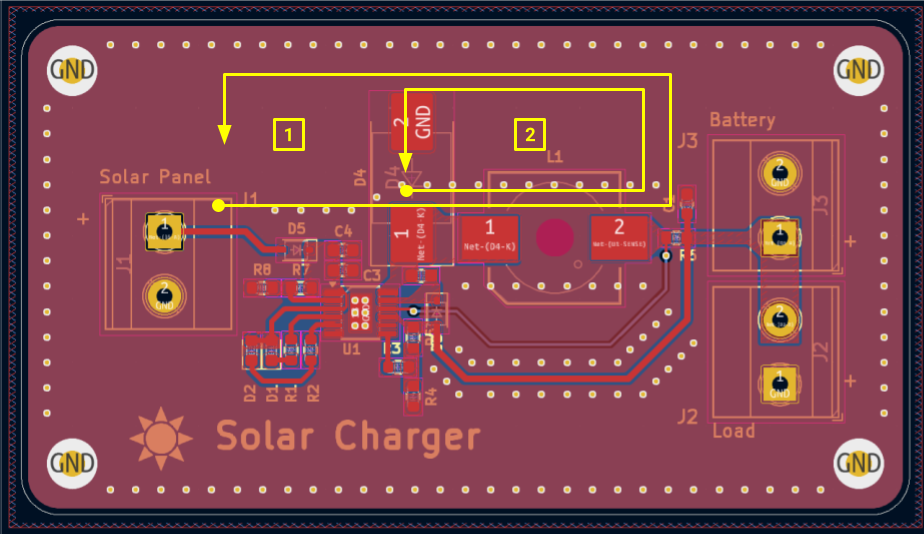
</p>
<p align="center"><i>Layout power loops</i></p>


## Final BOM 📃
* 2× [ICR18650 2600mAh 3.7V by PKCELL](https://www.batterypkcell.com/pkcell-18650-3-7v-2200mah-new-rechargeable-lithium-battery-product/)
* [12V 4.2W Solar Panel Module](https://www.amazon.ca/Portable-Polysilicon-Battery-Charger-Efficiency/dp/B07S1P67HL/ref=sr_1_97_sspa?crid=2WAO18NW0X2GN&dib=eyJ2IjoiMSJ9.fZVIoLELaw3YZhhkogK5VGuvzYc6wwH_Px50gEwUL5AK6Nxr_yeX3NtH-g3Q1hlIK30yAnZ0evMQHhDVoLYAm4sbS6SBN7zU1qKFeF3U7BU.zWxxjvWhspQamoYMqpsdiUn7VfXNYG4ixH8fwb_Tuoc&dib_tag=se&keywords=solar+cell&qid=1717475335&s=hi&sprefix=solar+ceil%2Ctools%2C96&sr=1-97-spons&sp_csd=d2lkZ2V0TmFtZT1zcF9hdGZfbmV4dA&psc=1)
* [Renogy 10 Watt 12 Volt Monocrystalline Solar Panel](https://www.amazon.ca/Renogy-Monocrystalline-Compact-Sprinkler-Applications/dp/B084MGS7KC/ref=mp_s_a_1_3?dib=eyJ2IjoiMSJ9.c6Ibopwzdw26-vXq0iM-t1X8KARw0PDHBEDa3QlSnucRRHnDQTm4tTqQhkWwJL5nBQfEcQG8s4SG3f0IUzD3oGxv7BOgHw_WdngOzWXWF6KB_JtXohbMmgxpaDqCVNrzySHuhJVVXBAElseQOjCSJATDCa9YTwj-vGisQsCN-2uRbedcTW2VFvSyFnXtX7MV--3pARRPw2olqf5FF4tQuw.rWuqIR5JHi2lb0LAExF7YcRQJTtzPzDO3Edo9STDuG8&dib_tag=se&keywords=10%2Bwatt%2Bsolar%2Bpanel&qid=1720388517&sr=8-3&th=1) (More powerful solar panel alternative)
    * [Datasheet](https://ca.renogy.com/content/renogy-day-2023/RNG-10D-SS-G1Datasheet.pdf)
    * Optimum Operating Voltage - 18V
    * Optimum Operating Current - 0.56A
* [LT3652EMSE#TRPBF - IC BATT CHG MULTI-CHEM 12MSOP](https://www.digikey.ca/en/products/detail/analog-devices-inc/LT3652EMSE-TRPBF/7838158)
* 1× [B5817WS-TP - DIODE SCHOTTKY 20V 1A SOD323](https://www.digikey.com/en/products/detail/micro-commercial-co/B5817WS-TP/2213553)
* 1× [SS2P2-M3/84A - Diode 20 V 2A Surface Mount DO-220AA (SMP)](https://www.digikey.ca/en/products/detail/vishay-general-semiconductor-diodes-division/SS2P2-M3-84A/1091548)
* 1× [MBRS340T3G - DIODE SCHOTTKY 40V 3A SMC](https://www.digikey.com/en/products/detail/onsemi/MBRS340T3G/918009)
* 2× [150060VS75000 - LED GREEN CLEAR 0603 SMD](https://www.digikey.ca/en/products/detail/w%C3%BCrth-elektronik/150060VS75000/4489906)
* 2× [ERJ-3EKF1101V - RES SMD 1.1K OHM 1% 1/10W 0603](https://www.digikey.ca/en/products/detail/panasonic-electronic-components/ERJ-3EKF1101V/196037)
* 2× [CL10A106MA8NRNC - CAP CER 10UF 25V X5R 0603](https://www.digikey.ca/en/products/detail/samsung-electro-mechanics/CL10A106MA8NRNC/3887527)
* 2× [CL10A105KA8NNNC - CAP CER 1UF 25V X5R 0603](https://www.digikey.ca/en/products/detail/samsung-electro-mechanics/CL10A105KA8NNNC/3886760)
* [RL0603FR-070R25L - RES 0.25 OHM 1% 1/10W 0603](https://www.digikey.ca/en/products/detail/yageo/RL0603FR-070R25L/5924891)
* [7447798241 - FIXED IND 24UH 4.5A 39.5MOHM SMD](https://www.digikey.ca/en/products/detail/w%C3%BCrth-elektronik/7447798241/2268621)
* [RC0603FR-07412KL - RES 412K OHM 1% 1/10W 0603](https://www.digikey.ca/en/products/detail/yageo/RC0603FR-07412KL/727227)
* [ERJ-3EKF3303V - RES SMD 330K OHM 1% 1/10W 0603](https://www.digikey.ca/en/products/detail/panasonic-electronic-components/ERJ-3EKF3303V/1746380)
* [ERJ-3EKF6802V - RES SMD 68K OHM 1% 1/10W 0603](https://www.digikey.ca/en/products/detail/panasonic-electronic-components/ERJ-3EKF6802V/1746444)
* [ERJ-3EKF1003V - RES SMD 100K OHM 1% 1/10W 0603](https://www.digikey.ca/en/products/detail/panasonic-electronic-components/ERJ-3EKF1003V/196075)
* [ERJ-3EKF2703V - RES SMD 270K OHM 1% 1/10W 0603](https://www.digikey.ca/en/products/detail/panasonic-electronic-components/ERJ-3EKF2703V/1746359)


## Manufacturing 🪛
I ordered the board through PCBWay by using the [KiCAD plugin](https://www.pcbway.com/blog/News/PCBWay_Plug_In_for_KiCad_3ea6219c.html). I assembled and soldered the components on the board myself. 

For the PCBWay specification selection I chose the following options:
* Layers: 2
* Material: FR-4
* FR4-TG: TG130-140
* Thickness: 1.6mm
* Min track/spacing: 5/5mil
* Solder mask: Red
* Silkscreen: White
* Edge connector: No
* Surface finish: HASL with lead
* Via process: Tenting vias
* Finished copper: 1 oz Cu
* Remove product Num: No

<p align="center">
    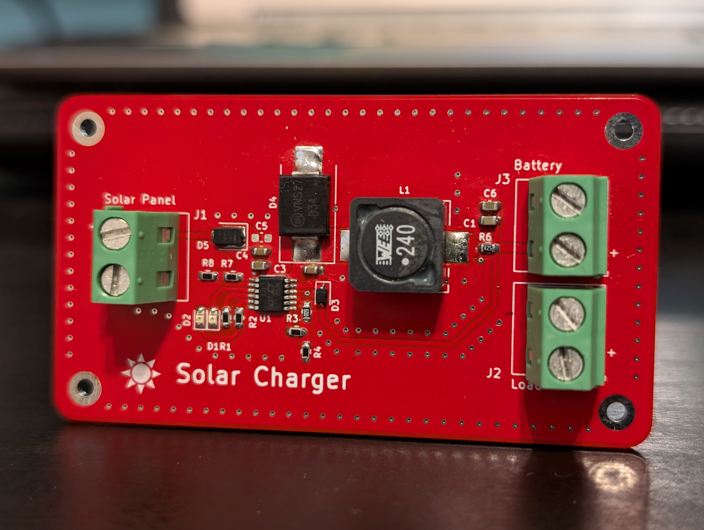
</p>
<p align="center"><i>Final Product</i></p>

## Characterization 🔬
Finally, I wanted to characterize the response of the circuit using my Analog Discovery 2 - USB oscilloscope. For my initial test setup, I connected the power input of the PCB to a power supply, configuring it to deliver 12V while limiting the current to 300mA. Additionally, I connected a pair of lithium-ion batteries to the PCB, which were discharged to approximately 7V.

### Efficiency 📈
To assess the circuit's output efficiency, I conducted the following calculations based on the input and output power.

#### Input
${P=V\cdot I=12V\cdot 0.275A=3.3W}$

#### Output
${P=V\cdot I=7.4\cdot 0.403A=2.9822W}$

${
\text{Efficiency} = \frac{P_{\text{out}}}{P_{\text{in}}} \cdot 100 = \frac{2.9822}{3.3} \cdot 100 = 0.9036 \cdot 100 = 90.4\\%
}$

<p align="center">
    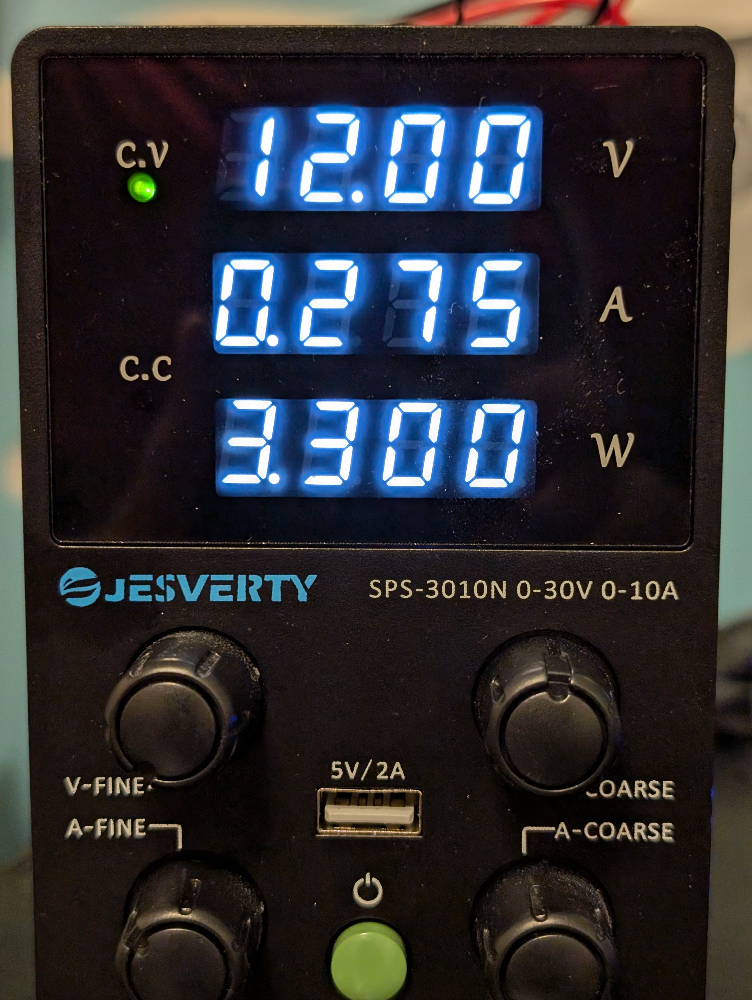
</p>
<p align="center"><i>Input Power</i></p>

<p align="center">
    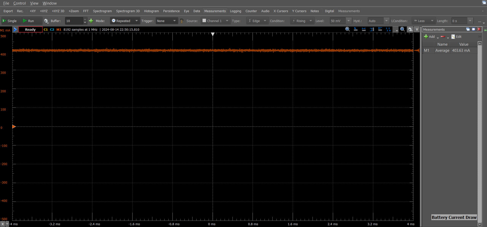
</p>
<p align="center"><i>Output Current</i></p>

### Thermal Imaging 🔥
I had the opportunity to conduct thermal imaging on the PCB during its operation by utilizing a FLIR thermal camera. As shown in the image, the primary hotspots were the input diode, battery management IC, and LED indicators. After approximately five minutes of operation at room temperature, the system began to stabilize, with peak temperatures reaching 52.4 degrees Celsius.

<p align="center">
    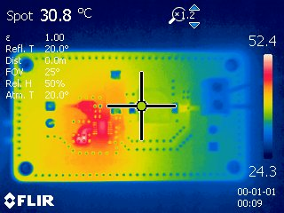
</p>
<p align="center"><i>Thermal Image</i></p>

### Output Voltage
The output voltage is well-centered around 7.4V, and the signal is generally acceptable. However, there are a few important observations to consider. First, there are ringing transients at the beginning of each recovery cycle of the converter. Second, the output ripple voltage is approximately 80mV. While this is within an acceptable range, it is slightly higher than desired. To reduce the output voltage ripple in a buck converter, consider selecting inductors with low parasitic capacitance and appropriate inductance values. Additionally, choose output capacitors with low equivalent series resistance (ESR) and equivalent series inductance (ESL). Increasing the output capacitance can also significantly suppress voltage ripple, thereby enhancing overall performance.

<p align="center">
    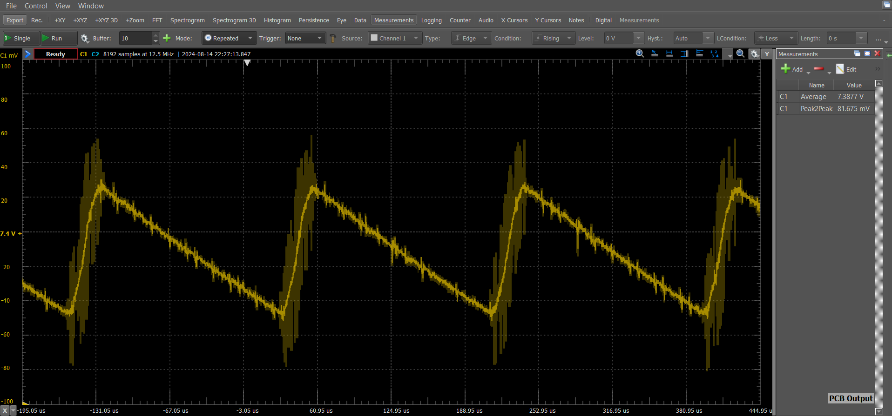
</p>
<p align="center"><i>Output Voltage</i></p>

### Switching Node
You can observe the switching node in the image below. As specified in the datasheet, the switching frequency is 1 MHz. Furthermore, as mentioned in the previous section, the same ringing transient is evident at both the rising and falling edges of the signal. Ringing on the switching node of a buck converter is primarily caused by parasitic inductances and capacitances. The interaction between these parasitics and the fast switching speeds of the MOSFETs leads to voltage overshoots and ringing, particularly during the diode's reverse recovery phase. While diode characteristics, such as reverse recovery, can affect the severity of ringing, they are not directly related to the diode's refresh speed.

<p align="center">
    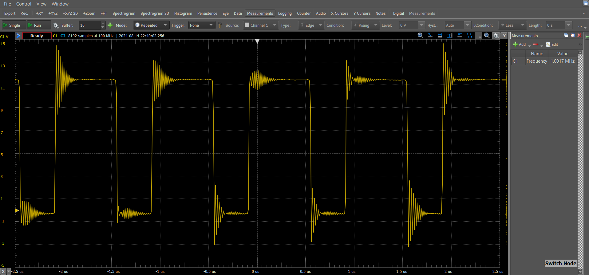
</p>
<p align="center"><i>Switching Node</i></p>

### Solar Test ☀️
For my final test setup, I connected the solar panel, lithium-ion battery pack, and Arduino to the PCB, then placed it in the bright sunlight around noon. On that day, a thin layer of clouds softened the sun's rays. I slightly discharged the battery to approximately 6.8V and set the Arduino to operate in a low-power state using the Narcoleptic library. During this time, the solar panel was able to produce 12V at around 172mA. Once everything was connected, I turned off the battery switch and measured the current draw of the Arduino by checking the voltage across the 0.25-ohm sense resistor. The voltage drop was approximately 9.4mV, indicating that the Arduino was consuming 37.6mA of current. This is significantly higher than what our initial testing of the Narcoleptic library suggested; however, the increased current draw could be attributed to the higher outside temperature. Finally, I turned on the battery switch and allowed the entire system to run. The Arduino remained powered on, executing its software while the battery charged slowly. I measured the current flowing into both the battery and the Arduino by probing the voltage across the 0.25-ohm sense resistor. The voltage drop was 53.2mV, indicating that both were consuming a total of 212.8mA. During full operation, the charge LED was illuminated, indicating that the circuit was functioning correctly and that the batteries were charging.

To assess the circuit's output efficiency during operating, I conducted the following calculations based on the input and output power.

#### Input
${P=V\cdot I=12V\cdot 0.172A=2.064W}$

#### Output
${P=V\cdot I=7.4\cdot 0.2128A=1.575W}$

${
\text{Efficiency} = \frac{P_{\text{out}}}{P_{\text{in}}} \cdot 100 = \frac{1.575}{2.064} \cdot 100 = 0.7629 \cdot 100 = 76.3\\%
}$

<p align="center">
    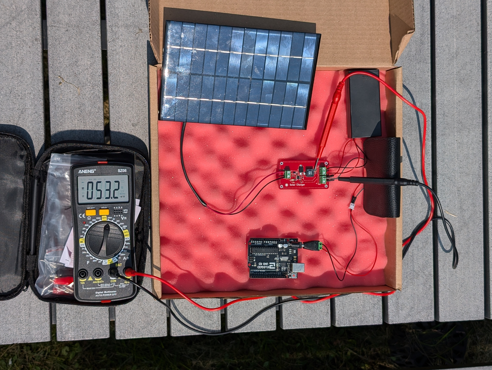
</p>
<p align="center"><i>Solar Test</i></p>


# Resources
* [Designing a Solar and Li-ion Battery Powered Charger / Power Source Part 1](https://www.youtube.com/watch?v=NaxtGdHR_6E)
* [The Arduino Guide to Low Power Design](https://docs.arduino.cc/learn/electronics/low-power/)
* [Power saving techniques for microprocessors](https://www.gammon.com.au/power)
* [narcoleptic](https://github.com/brabl2/narcoleptic)
* [How to Permanently Store Data on an Arduino's Built-in EEPROM](https://www.digikey.ca/en/maker/blogs/2021/how-to-permanently-store-data-on-an-arduinos-built-in-eeprom)
* [Switching Regulator PCB Design - Phil's Lab #60](https://www.youtube.com/watch?v=AmfLhT5SntE)
* [Common Mistakes in DC/DC Converters and How to Fix Them](https://login.ti.com/as/authorization.oauth2?response_type=code&scope=openid%20email%20profile&client_id=DCIT_ALL_WWW-PROD&state=H5b-fq0Q4IgyNCEjBbyU4sybOCs&redirect_uri=https%3A%2F%2Fwww.ti.com%2Foidc%2Fredirect_uri%2F&nonce=n3bXoPABEGb6cJAH1qzcaZyaWSE1Pe7WqVE4aP_YNXY&response_mode=form_post)
* [Constructing Your Power SupplyLayout Considerations](http://www.submm.caltech.edu/kids_html/DesignLog/DesignLog179/MillerMUSICReadoutDocs/slup230.pdf)
* [PCBWAY Custom Design Rules Templates](https://www.pcbway.com/pcb_prototype/PCB_Design_Rule_Check.html?currency=1)